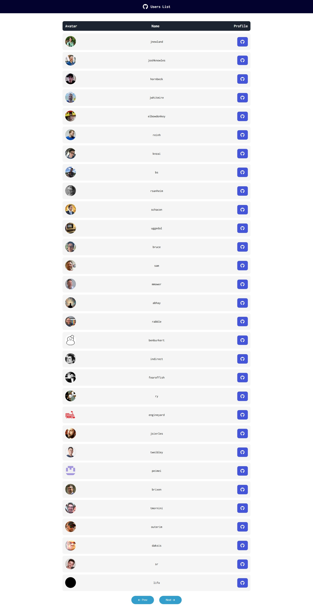

# github-users-list

This is a React app that uses the [GitHub REST API](https://docs.github.com/en/rest/quickstart?apiVersion=2022-11-28) to fetch user's data.

## Table of contents

- [Overview](#overview)
  - [The challenge](#the-challenge)
  - [Links](#links)
  - [Built with](#built-with)

## Overview

### The challenge

Users should be able to:

- See a loading state while data is being fetched
- View user's avatar, name and profile link fetched from the GitHub API
- Click on "Prev" and "Next" buttons to navigate between list of GitHub users

### Links

- Solution URL: [https://github.com/f29pereira/github-users-list](https://github.com/f29pereira/github-users-list)
- Live Site URL: [https://f29pereira.github.io/github-users-list/](https://f29pereira.github.io/github-users-list/)

### Built with

- Semantic HTML5 markup
- CSS custom properties
- Flexbox
- Mobile-first workflow
- [React](https://reactjs.org/) - JS library
- [Next.js](https://nextjs.org/) - React framework
- [GitHub REST API](https://docs.github.com/en/rest/quickstart?apiVersion=2022-11-28)
